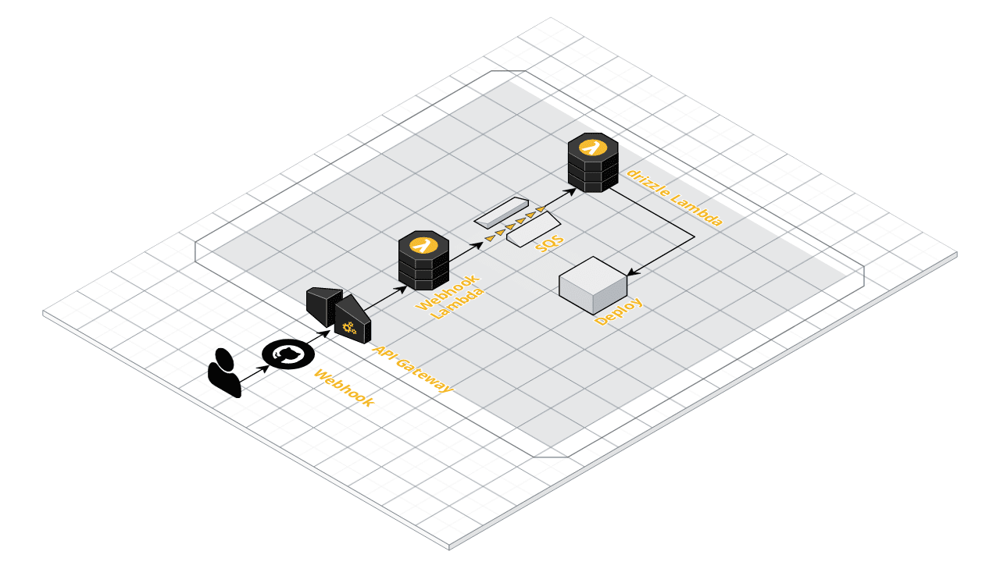

# Welcome to the "drizzle infrastructure" CDK project

Infrastructure code to create a serverless CI/CD pipeline on AWS.

Part of [Drizzle - Serverless CI/CD Pipeline With AWS Lambda](https://www.uphill.dev/blog/drizzle-ci-cd-pipeline/) blog
post on [uphill.dev](https://www.uphill.dev).

Will create the following:

This is a project for TypeScript development with CDK.

## How to run

Please note: The CDK project builds the custom docker Lambda as well as the webhook Lambda. Which means, that 
you can't currently use this script on an Apple Silicon chip (like a M1).

Clone the following repositories into the same folder and execute the CDK project. Also, see the blog post ;)

* [drizzle Lambda](https://github.com/hill-daniel/drizzle)
* [CDK Infrastructure](https://github.com/hill-daniel/drizzle-infrastructure) (this one)
* [Webhook Lambda](https://github.com/hill-daniel/drizzle-webhook)

Afterwards, in this project:

* Copy .env.template, rename to .env and insert a GitHub repository ID of a repository for which you want to create a
  pipeline (just uses the ID to verify incoming webhooks)
* `npm run build`   compile typescript to js
* `cdk synth`       emits the synthesized CloudFormation template
* `cdk deploy --all`      deploy this stack to your default AWS account/region
* Configure webhook in GitHub repository settings,
  see [Validating A GitHub Webhook Request With AWS Lambda](https://www.uphill.dev/blog/validating-github-webhook/#github-configuration)

The `cdk.json` file tells the CDK Toolkit how to execute your app.

## Useful commands

* `npm run build`   compile typescript to js
* `npm run watch`   watch for changes and compile
* `npm run test`    perform the jest unit tests
* `cdk deploy --all`      deploy this stack to your default AWS account/region
* `cdk diff`        compare deployed stack with current state
* `cdk synth`       emits the synthesized CloudFormation template
